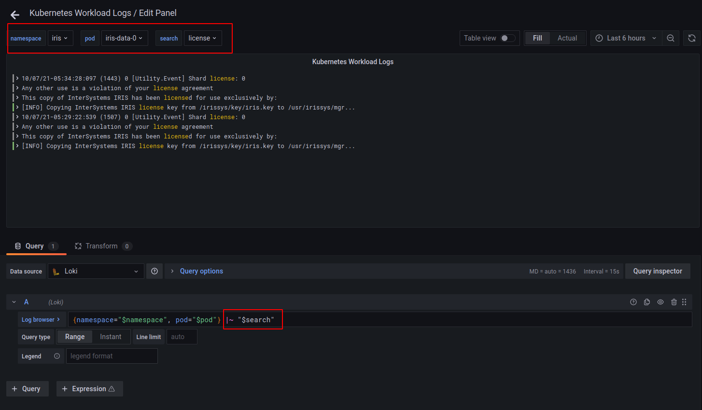
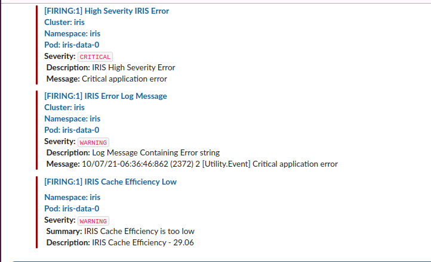

### Content
- [Introduction](#introduction)
- [Tooling](#tooling)
- [Infrastructure setup](#infrastructure-setup)
- [IKO pre-steps](#iko-pre-steps)
- [Set environment variables](#set-environment-variables)
- [Install everything](#install-everything)
- [Note about Certificate](#note-about-certificate)
- [Grafana](#grafana)
- [Alerting](#alerting)
- [Cleanup](#cleanup)

### Introduction

This project shows one of the ways to setup monitoring (metrics/logs) for IRIS deployed in Kubernetes (GKE). You'll need:
- GKE cluster (skip [Infrastructure setup](#infrastructure-setup) section if you already have one
- Install some [Tooling](#tooling) locally
- Download IKO and perform [some steps](#iko-pre-steps)
- Set several [environment variables](#set-environment-variables)
- Actually install IKO, IRIS, Monitoring/Logging systems and applications that enables an encrypted external access to cluster ([ingress-nginx](https://kubernetes.github.io/ingress-nginx/) and [cert-manager](https://github.com/jetstack/cert-manager)) in a **single** command.
- Cleanup GCP resources when you don't need them anymore

### Tooling

The next tools are used:
- [gcloud](https://cloud.google.com/sdk/docs/install) `Google Cloud SDK 357.0.0`
- [kubectl](https://kubernetes.io/docs/tasks/tools/#kubectl) `version v1.17.12`
- [helm](https://helm.sh/docs/intro/install/) `version v3.6.3`
- [helmfile](https://github.com/roboll/helmfile#installation) `version v0.139.9`
- [k9s](https://github.com/derailed/k9s) `version v0.24.15`. Optional. Handy tool for daily operations with Kubernetes

### Infrastructure setup
**Note**: skip this step if you already have a Kubernetes installed. This section is intended for those who want to create a [Kubernetes cluster in Google Cloud](https://cloud.google.com/kubernetes-engine) from the scratch. Be aware of [Pricing](https://cloud.google.com/pricing) and [Free tier](https://cloud.google.com/free).
We need to create a [project](https://cloud.google.com/appengine/docs/standard/nodejs/building-app/creating-project) (referred as <PROJECT_ID> below) first in GCP. For security reasons it's better to create a [private GKE cluster](https://cloud.google.com/kubernetes-engine/docs/how-to/private-clusters) in a separate network. So we need to create such a network as well as [Cloud NAT](https://cloud.google.com/nat/docs/overview) to allow connections to the Internet from GKE worker nodes.
Also we'll need to create a [Cloud Storage Bucket](https://cloud.google.com/storage) to enable a Logging system (we'll use [Loki](https://grafana.com/oss/loki/)) to store logs.

To perform these steps run these commands:

##### Initialize connection to Google Platform
```
$ gcloud init
$ gcloud auth login
$ gcloud projects list
$ gcloud config set project <PROJECT_ID>
```
##### Create a dedicated network

We'll use name "iris" for different GCP resources. Feel free to use your own naming convention.
Adjust a region and IP ranges correspondingly to your needs.

```
$ gcloud compute networks create iris --subnet-mode custom
$ gcloud compute networks subnets create iris --network iris --range 10.20.0.0/24 --region us-east1 --secondary-range pods=10.42.0.0/16,services=172.20.0.0/16
```
##### Assign static IPs

Those IPs will be used for Cloud NAT and LoadBalancer (created by ingress-nginx) endpoints.
```
$ gcloud compute addresses create iris-nat --region=us-east1
$ gcloud compute addresses create iris-gke --region=us-east1
```
##### Create Cloud NAT
```
$ gcloud compute routers create iris --network=iris --region us-east1
$ gcloud compute routers nats create iris --router=iris --nat-all-subnet-ip-ranges --nat-external-ip-pool=iris-nat --region=us-east1
```
##### Create Storage Bucket
Remember that Storage Bucket name should be unique across entire GCP network. See [Bucket naming guidelines](https://cloud.google.com/storage/docs/naming-buckets).
We'll refer to Storage Bucket as <BUCKET_NAME>.
```
$ gsutil mb -l us gs://<BUCKET_NAME>
```
##### Add a firewall rule for InterSystems Kubernetes Operator
Additional step to let IKO do its job.
```
$ gcloud compute firewall-rules create iris-iko --network iris --allow tcp:8443 --source-ranges 10.0.0.0/28 --target-tags iris-node
```
##### GKE cluster setup
Choose a suitable region, `us-east1` is used in this example.
Also choose the recent `cluster-version` as it's released quite often.
```
$ gcloud container clusters create iris    \
  --region us-east1                        \
  --machine-type e2-medium                 \
  --num-nodes 1                            \
  --image-type COS_CONTAINERD              \
  --enable-private-nodes                   \
  --enable-shielded-nodes                  \
  --no-enable-master-authorized-networks   \
  --cluster-version 1.20.10-gke.1600       \
  --enable-ip-alias                        \
  --cluster-ipv4-cidr 10.24.0.0/14         \
  --master-ipv4-cidr 10.0.0.0/28           \
  --services-secondary-range-name services \
  --cluster-secondary-range-name pods      \
  --no-enable-autoupgrade                  \
  --enable-autorepair                      \
  --network iris                           \
  --subnetwork iris                        \
  --logging NONE                           \
  --monitoring NONE                        \
  --tags iris-node                         \
  --scopes storage-rw
```
**Notes**:
- Worker nodes use `containerd` runtime instead of `docker`. Useful links to read are [Container runtimes](https://kubernetes.io/docs/setup/production-environment/container-runtimes/) and [Don't Panic: Kubernetes and Docker](https://kubernetes.io/blog/2020/12/02/dont-panic-kubernetes-and-docker/)
- Cluster is regional and private
- Cloud Monitoring and Logging are disabled as we use our own monitoring. Feel free to leave a default monitoring
- Loki should be able to write into Cloud Storage, so we have added `storage-rw` scope

##### Connect to cluster
```
$ gcloud container clusters get-credentials iris --region us-east1 --project <PROJECT_ID>
```

### IKO Pre-steps
Download IKO as recommended on [official site](https://docs.intersystems.com/irislatest/csp/docbook/DocBook.UI.Page.cls?KEY=AIKO#AIKO_archive).
IKO Version used in this repo is `3.1.0.94.0`.
It's assumed that after downloading you'll have an IKO directory in the repository root directory:
```
$ ls -1
dashboards
helmfile.yaml
iko.yaml
iris-license.yaml
iris_operator-3.1.0.94.0
...

$ tree iris_operator-3.1.0.94.0/
iris_operator-3.1.0.94.0/
├── 111README
├── chart
│   └── iris-operator
│       ├── Chart.yaml
...
```
One of the ways to download IKO image from inside Kubernetes is [Create a secret for IKO image pull information](https://docs.intersystems.com/irislatest/csp/docbook/DocBook.UI.Page.cls?KEY=AIKO#AIKO_pullsecret_iko). Another way is download this image locally and re-push it into available GCR repository. For the second option run the following commands after unpacking IKO archive (`[eu.]gcr.io` means either `eu.gcr.io` or `gcr.io`, it depends on location of your GKE cluster):
```
$ docker load -i iris_operator-3.1.0.94.0/image/iris_operator-3.1.0.94.0-docker.tgz
$ docker tag intersystems/iris-operator:3.1.0.94.0 [eu.]gcr.io/<PROJECT_ID>/iris-operator:3.1.0.94.0
$ docker push [eu.]gcr.io/<PROJECT_ID>/iris-operator:3.1.0.94.0
```
### Set Environment Variables
Several variables are used inside an installation procedure. It enables us to have flexible settings and use this procedure in CI/CD pipelines where variables could be set in CI/CD secrets and not stored in repository. Some variables are obvious, some require a little effort to get them, like Slack URL or Domain Name registration.

##### Create Slack channel to receive alerts
Use [Sending messages using Incoming Webhooks](https://api.slack.com/messaging/webhooks) link to create a Slack channel (call it **#iris-in-k8s-alerting**) and retrieve its Webhook URL. This URL is referred as `SLACK_API_URL` below. Actually, you could use another Slack channel name, but for that you'll need to update this name in a file [alertmanager.yaml](alertmanager.yaml) (grep by `channel` word).

##### Create Domain Name
Above we've created two static IP addresses, for NAT and Kubernetes Ingress. Let's add a Domain Name to Ingress IP-address. Use a preferred Domain registrar (GoDaddy, AWS Route53 etc.) for that.
Define IP address first:
```
$ export LOAD_BALANCER_IP=$(gcloud compute addresses list --project <PROJECT_ID> --filter="name~'^iris-gke$'" --format="value(Address)")
```
Then create A-record in Domain Registrar console. This process varies between different registrars and isn't described here.

##### Double check that IKO directory is on place
Be sure that the root directory contains `iris_operator-3.1.0.94.0` directory downloaded and unpacked on [IKO Pre-steps](#iko-pre-steps) stage. This directory with IKO Helm chart will be used in an installation procedure.

##### Set several environment variables
```
# Set IKO image location
$ export IKO_REGISTRY=[eu.]gcr.io/<PROJECT_ID>
$ export IKO_REPO=iris-operator
$ export IKO_VERSION=3.1.0.94.0

# Set your domain name
$ export DOMAIN=<DOMAIN>

# Set Storage Bucket name
$ export BUCKET_NAME=<BUCKET_NAME>

# This step was done before, mentioned here just as reminder
$ export LOAD_BALANCER_IP=$(gcloud compute addresses list --project <PROJECT_ID> --filter="name~'^iris-gke$'" --format="value(Address)")
$ echo $LOAD_BALANCER_IP

# Set a password for Grafana
$ export GRAFANA_PASSWORD=<Set your Grafana Password>

# Set Slack API URL. You get this URL in `Create Slack channel to receive alerts` step
$ export SLACK_API_URL=https://hooks.slack.com/services/XXXX/YYYY/zzzz
```
##### Set email for Let's Encrypt notifications
In both `lets-encrypt-*` files set `spec.acme.email` to your email. It will be used by Let's Encrypt to send notifications about certificate expiration time.

### Install everything
```
$ helmfile sync
```
After installation is finished you might check if everything is installed and running. If you see "deployed" statuses, everything is going well (*time-format* is added to shorten the output):
```
$ helm ls --all --time-format "2006-01-02" -A
NAME         	NAMESPACE    	REVISION	UPDATED   	STATUS  	CHART                       	APP VERSION
cert-manager 	cert-manager 	1       	2021-10-07	deployed	cert-manager-v1.5.3         	v1.5.3     
ingress-nginx	ingress-nginx	1       	2021-10-07	deployed	ingress-nginx-4.0.3         	1.0.2      
iris-operator	iris         	1       	2021-10-07	deployed	iris-operator-3.1.0         	3.1.0.94.0 
loki         	logging      	1       	2021-10-07	deployed	loki-stack-2.4.1            	v2.1.0     
prometheus   	monitoring   	1       	2021-10-07	deployed	kube-prometheus-stack-18.0.3	0.50.0  
```

### Note about Certificate
Visit this page: https://\<DOMAIN\>/grafana. Set DOMAIN to a value retrieved on [Create Domain Name](#create-domain-name) stage.
You should see a warning about **SEC_ERROR_UNKNOWN_ISSUER**. It's due to certificate was issued by [Let's Encrypt (LE) Staging](https://letsencrypt.org/docs/staging-environment/). Such approach is handful on development environments. In production you'll need to replace Staging by Production. For that edit [prometheus-values.yaml](prometheus-values.yaml) file and replace `grafana.ingress.annotations` by `cert-manager.io/cluster-issuer: lets-encrypt-production` value and re-run `helmfile sync`.
For now just "Accept the Risk and Continue".

### Grafana
Login to Grafana with `admin/<GRAFANA_PASSWORD>`.
This page [https://\<DOMAIN\>/grafana/dashboards](https://\<DOMAIN\>/grafana/dashboards) should show you a bunch of ready to use dashboards. Almost all of them are created by Prometheus installation and enable us to monitor Kubernetes resources without additional efforts.
We've added two dashboards for our needs:
- **SAM like Dashboard** ([https://\<DOMAIN\>/grafana/d/YuWR5KN7z/sam-like-dashboard](https://\<DOMAIN\>/grafana/d/YuWR5KN7z/sam-like-dashboard)) that demonstrates panels similar to SAM. One panel with IRIS logs is added
- **Kubernetes Workload Logs** ([https://\<DOMAIN\>/grafana/d/D5luqGInk/kubernetes-workload-logs](https://\<DOMAIN\>/grafana/d/D5luqGInk/kubernetes-workload-logs)) that enables us to view logs of every pods in Kubernetes and even perform a search by desired word. A simple [LogQL query](https://grafana.com/docs/loki/latest/logql/) is used under the hood:


### Alerting
Let's emulate a critical error in IRIS. Exec into `iris-data-0` pod for that and type the following commands:
```
$ iris session iris
USER>do $zu(9,"","Critical application error","",2)
USER>halt
```
Now let's check alerts in a Slack channel configured in [Create Slack channel to receive alerts](#create-slack-channel-to-receive-alerts) stage:


There should be alerts "IRIS Cache Efficiency Low", "IRIS Error Log Message", "High Severity IRIS Error" as well as other Kubernetes-related alerts (if something isn't good in a cluster).

Feel free to reconfigure existing and create new alerts.

Custom metrics-based alerts are located in [prometheus-rules.yaml](prometheus-rules.yaml) file.

Custom logs-based alerts are located in [loki-values.yaml](loki-values.yaml) file (section `alerting_groups`).

Please, don't forget to re-run `helmfile sync` after configuration changes.

### Cleanup
If you don't need created in this example GCP resources anymore, you can remove them:
```
$ gcloud --quiet container clusters delete iris --region us-east1
$ gsutil rm -r gs://<BUCKET_NAME>
$ gcloud --quiet compute routers nats delete iris --router=iris --region=us-east1
$ gcloud --quiet compute routers delete iris --region=us-east1
$ gcloud --quiet compute addresses delete iris-gke --region=us-east1
$ gcloud --quiet compute addresses delete iris-nat --region=us-east1
$ gcloud --quiet compute firewall-rules delete iris-iko
$ gcloud --quiet compute networks subnets delete iris --region us-east1
$ gcloud --quiet compute networks delete iris
```